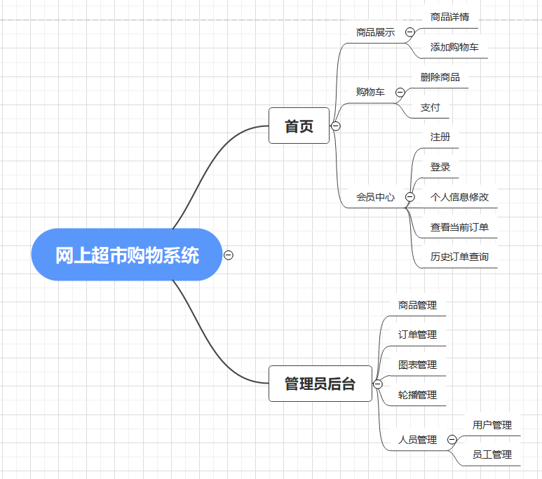
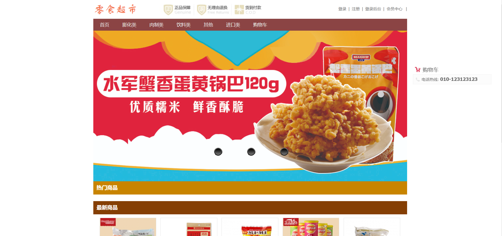
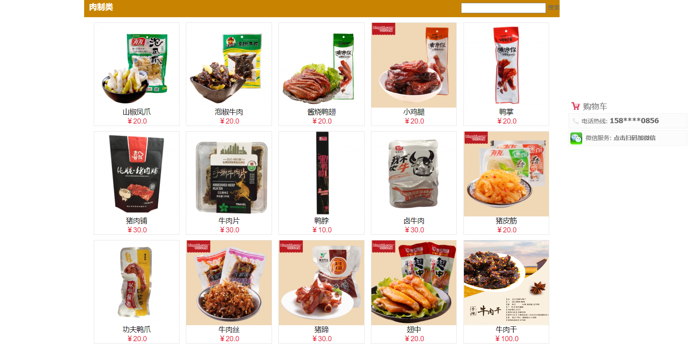
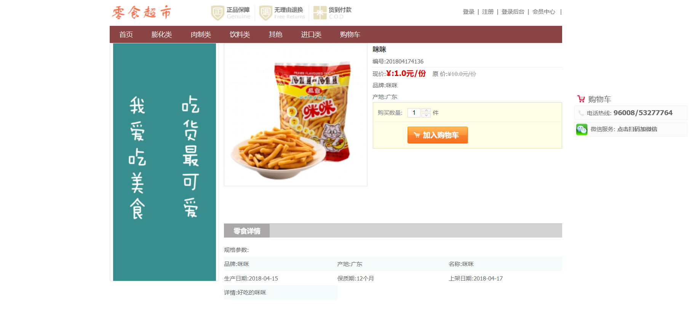
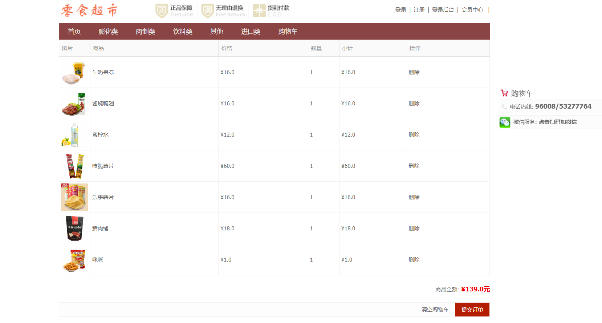
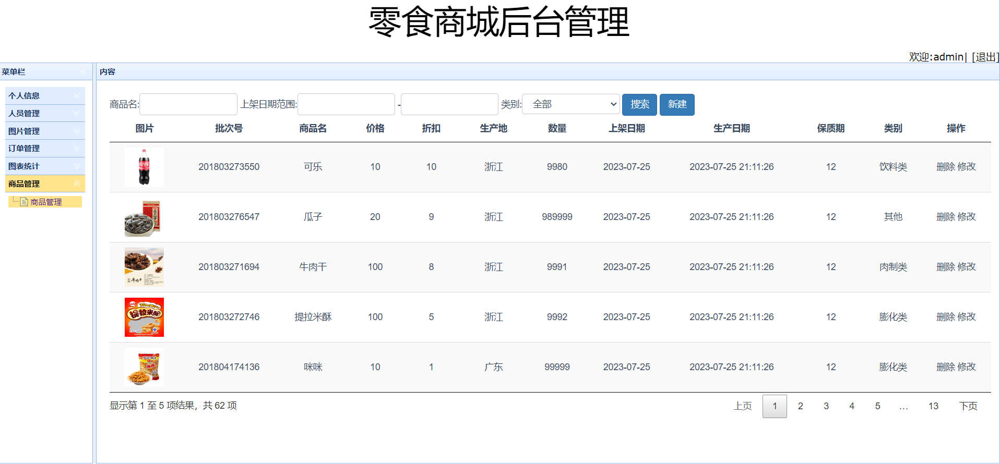
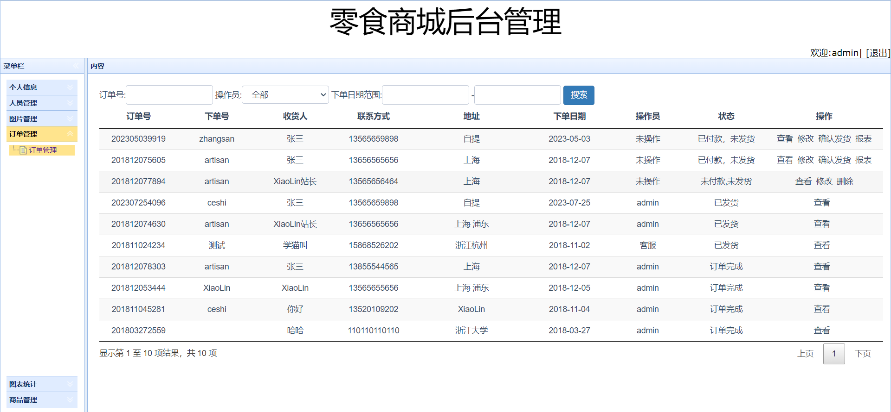

# 基于Java的零食超市购物系统 

（源代码+12000字文档+ppt）

## 项目简介

基于Java的零食超市购物系统，是一套包含了管理员上架商品、用户购物、购物车、支付等一系列操作的购物系统。 
以Spring框架为基础，数据库使用的是mysql数据库。 
该系统功能完善，界面美观，非常适合作为毕设或者课程作业以及新手开发学习。 

## 视频介绍
<a href="https://www.bilibili.com/video/BV1tj41147eP/?spm_id_from=333.999.0.0" target="_blank">点击查看B站视频介绍</a>

## 功能介绍
 

## 技术服务

## 系统图片
#### 1.商城首页
 
#### 2.商品列表
 
#### 3.商品详情页
 
#### 4.购物车
 
#### 5.管理端商品管理
 
#### 6.管理端订单管理
 

